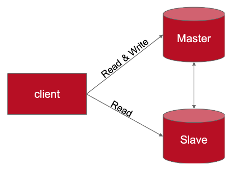

# Distributed Key-Value Store
A simple distributed key-value store which consists of two replicas.

### Description
In this prototyping assignment, you will implement a simple distributed key-value store which consists of two replicas, whereby one is the master and one is the slave.Clients always write to the master but can potentially read from both replica.

You  are  free  in  your  choice  of  implementation  for  communication  between  nodes –you  can implement everything from scratch based on sockets, you can use Thrift, Avro, Edge, etc., or you can use  hermes. We  recommend  usingand  supporthermes which is  a  very  simple communication middleware.Itis  designed  for  simplicity  and  ease  of  use  and  allows the  implementation  of synchronous and asynchronous client and server communication with very few lines of code.

#### Distributed Key-Value Store Implementation
As already mentioned, you are very free in your design choices but the following features must be supported:

- Java-based implementation with good documentation (Javadoc, ...).
- Replica-local key-value store implementation that is persists to the file system.
- A simple client for the system exposingaCRUD interface as methods.
- AWS EC2 Deployment of two key-value storage system nodes, where one node acts as a master and the second one as a slave. Within that system.
    * Read operations execute locally within the node that has received the read request.
    * Write operations are first processed by the master replica and then forwarded to and processed  by  the  slave  replica.
    Hereby,  both,  synchronous  and  asynchronous replication must be supported.

#### Benchmarking Latency and Staleness
- Test Client: Extend your client to automatically issue one update operation every second.Issue 100 updatesand use the same key every time.

- Latency Measurements: Latency is defined as the period of time between the start and the commit timestamp of a write operation. If not already done: Extend your client implementation so that it captures and logs these timestamps/the latency

- Staleness Measurements: Staleness is defined as the period of time between the commit timestamp of the corresponding write operation (=timestamp at which the write terminates) and the point in time when the last replica is written.
    * Example: A write starts at T=0 and commits at T=2. The first replica is written at T=2, the second at T=5. 
    In thatcase, staleness would be 3 (=5-2).
    
If  not  already  done:  Extend  your  system  in  a  way  that  it  logs  for  each  update  operation  the corresponding timestamps on each replica. Hint: To identify writes you might want to assign an ID to each write (e.g., as value which is written) and log that as well.

#### Analysis:
Calculate minimum, maximum and average latency and stalenessfor the test client workload. Describe and discuss whether they meet your expectations.You can create and include charts if helpful.